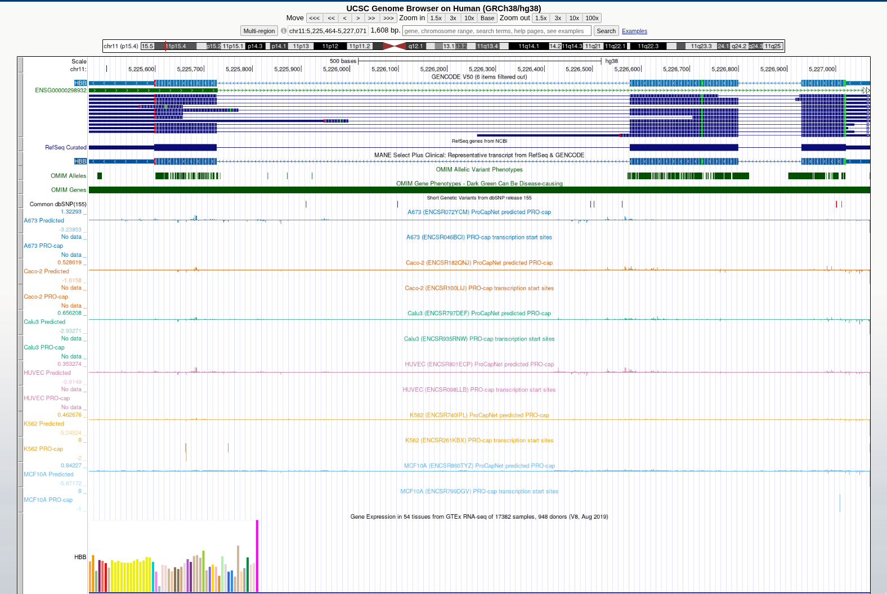
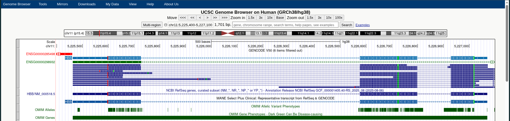
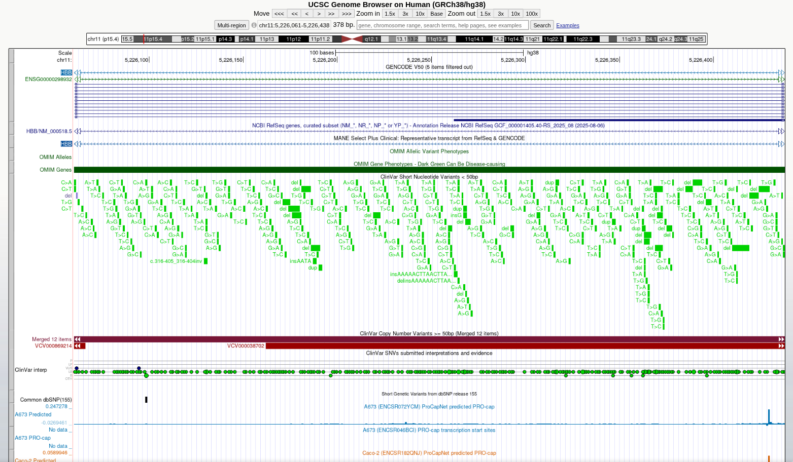
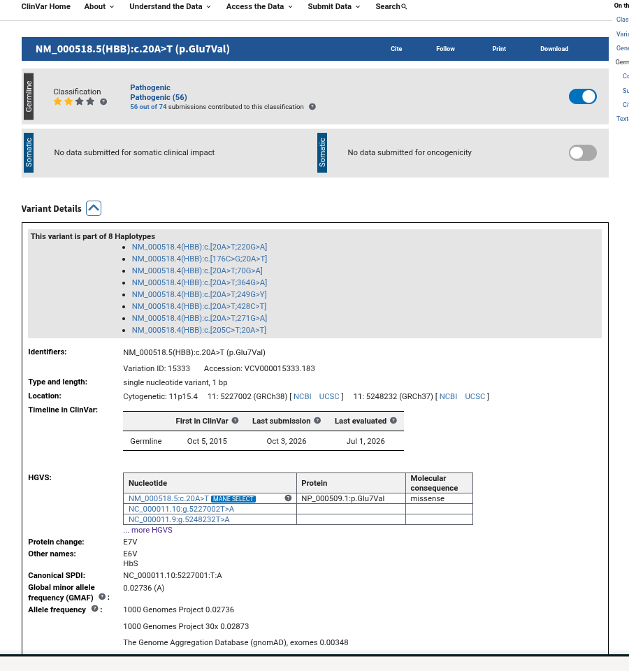
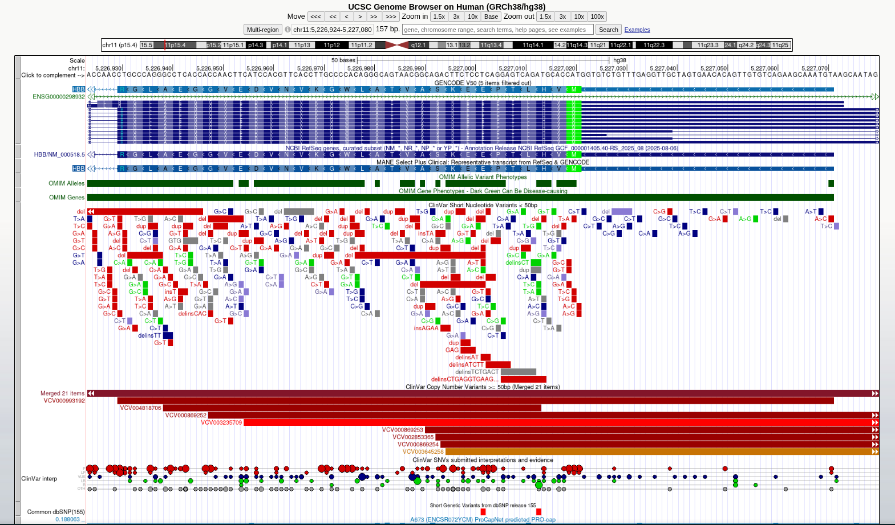

# HBB_SickleCell_Genomics_Report

## BIOINFORMATICS LABORATORY REPORT
### Exploring the *HBB* Gene and Mapping the Primary Variant in Sickle Cell Disease

- **Student Name:** Richelle O. Gregorio
- **Assigned Gene:** HBB (Hemoglobin Subunit Beta)
- **Associated Disease:** Sickle Cell Disease / Sickle Cell Anemia
- **Genome Assembly:** Human GRCh38/hg38
- **Disease Description:** Sickle cell disease is an autosomal recessive blood disorder caused by pathogenic variants in the *HBB* gene. It leads to abnormal hemoglobin (HbS) that polymerizes under low oxygen conditions, turning red blood cells into rigid, sickle-shaped cells that cause hemolytic anemia and vaso-occlusion.

----
## Part B. UCSC Gene Location

- **Official Gene Symbol:** HBB
- **Full Gene Name:** Hemoglobin subunit beta
- **Chromosome:** Chromosome 11 (11p15.4)
- **Genome Assembly Used:** GRCh38/hg38
- **Genomic Coordinates:** chr11:5,225,464-5,227,071
- **DNA Strand:** - (Minus/Reverse strand)
- **Approximate Gene Size:** ~1,608 base pairs (~1.6 kb)

  
*Figure 1. Overview of the HBB gene location on Chromosome 11 in the UCSC Genome Browser.*

---

## Part C. Exons, Introns, and Transcripts

Selected transcript: NM_000518.5  

| Parameter | Observation |
| :--- | :--- |
| **Number of exons identified** | 3 exons |
| **Multiple transcripts/isoforms visible** | Multiple isoforms were visible across GENCODE and RefSeq tracks, though a single primary canonical transcript model (NM_000518.5) is prominently displayed. |
| **Difference between an exon and an intron** | Exons are protein-coding or untranslated regions retained in mature mRNA after splicing, whereas introns are non-coding intervening sequences removed during RNA processing. |
| **Relative length of introns and exons** | Introns generally appeared longer than exons, with Intron 2 taking up the largest portion of the gene structure relative to Exons 1 and 2. |

  
*Figure 2. Zoomed-in view showing the 3 exon blocks and connecting intron lines of HBB.*

---
## Part D. UCSC Annotation Tracks

- **A. Gene annotation track used:**
The NCBI RefSeq and GENCODE V50 gene annotation tracks were used to examine the *HBB* gene.

- **B. ClinVar-related variant marks:**
Yes. A dense cluster of ClinVar-related variant marks was visible directly underneath and within the *HBB* gene region when the ClinVar Variants track was turned on.

- **C. Conservation of regions:**
Yes. The 100 Vertebrates Conservation track showed strong conservation peaks across the *HBB* coding region.

- **D. Location of conserved regions:**
Strong conservation signals appeared primarily across all three coding exons of the *HBB* gene across vertebrate species.

- **E. Why strong conservation suggests biological importance:**
Strong conservation indicates that a sequence has remained unchanged through evolution. This suggests critical biological function, meaning nucleotide changes in these regions are often harmful and selected against.

  
*Figure 3. HBB gene model shown with the ClinVar variant track turned on.*

---

## Part E. Selected ClinVar Variant

| Item | Information |
| :--- | :--- |
| **a. Gene** | HBB |
| **b. Variant name/HGVS description** | NM_000518.5(HBB):c.20A>T (p.Glu7Val) |
| **c. rsID or ClinVar Variation ID/VCV accession** | rs334; Variation ID: 15333; VCV000015333 |
| **d. Chromosome and genomic position** | Chromosome 11; GRCh38: chr11:5,227,002; cytogenetic location: 11p15.4 |
| **e. Associated condition/disease** | Sickle cell disease |
| **f. Clinical significance exactly as reported by ClinVar** | Pathogenic |
| **g. Review status, if shown** | Practice guideline / Criteria provided, multiple submitters, no conflicts |
| **h. ClinVar record URL** | https://www.ncbi.nlm.nih.gov/clinvar/variation/15333/ |

  
*Figure 4. NCBI ClinVar database entry for the pathogenic Sickle Cell mutation (15333).*

----

##. Part F. Locating the Variant in UCSC

- **A. Where is the variant located relative to your gene?** The variant is located within Exon 1 of the *HBB* gene on chromosome 11 at GRCh38 position 5,227,002.

- **B. Region classification:** It is located in a coding exon (Exon 1) of the *HBB* gene within the NM_000518.5 transcript.

- **C. Coding vs. non-coding:** It is located in a coding region because it overlaps the coding sequence (CDS) of *HBB* and directly causes the protein substitution p.Glu7Val.

- **D. Effect on gene product:** ClinVar classifies the variant as Pathogenic and identifies it as a missense substitution. The c.20A>T substitution replaces hydrophilic glutamic acid with hydrophobic valine at position 7 (p.Glu7Val). This change causes mutant hemoglobin S (HbS) molecules to polymerize under low oxygen conditions, causing red blood cells to become rigid and sickle-shaped.

- **E. Additional evidence needed:** Additional evidence would include in vitro functional assays measuring hemoglobin polymerization and cell sickling, family pedigree segregation analysis, population allele frequency statistics (such as gnomAD), and clinical blood smear evaluation.

  
*Figure 5. Precise mapping of coordinate chr11:5,227,002 inside Exon 1 of HBB.*

----

## Interpretation

  Knowing the exact location of a mutation is very important because a change in a coding exon can directly alter protein structure, whereas a change in an intron or regulatory region might affect RNA splicing or gene expression levels. This distinction explains why deleting three nucleotides yields a completely different outcome than deleting one nucleotide. Deleting three bases removes one whole codon while preserving the overall reading frame, whereas deleting a single nucleotide causes a frameshift that completely alters how all downstream bases are grouped into codons, changing the subsequent amino acid sequence and usually creating a premature stop codon. However, not every single DNA mutation changes the protein product or destroys its function. Due to the degeneracy of the genetic code, synonymous mutations change a codon without changing the encoded amino acid. Furthermore, even when an amino acid substitution does occur, conservative substitutions or changes outside active catalytic sites may preserve normal protein folding and activity. Conversely, when a frameshift or nonsense mutation introduces a premature stop codon, translation is terminated too early. This produces a truncated, incomplete peptide that typically lacks essential functional domains or undergoes nonsense-mediated mRNA decay, resulting in a non-functional gene product.

----

## Part G. Reflection

1. **What UCSC showed beyond textbook descriptions:** Visualizing *HBB* in UCSC made it clear how compact the gene is (~1.6 kb with 3 exons) while displaying a remarkably high density of disease-causing variants clustered within its small coding sequence[cite: 2].

2. **Why exact genomic coordinates matter:** Knowing the exact coordinate (`chr11:5,227,002`) allowed me to map the base change directly inside Exon 1, making it straightforward to connect the specific DNA mutation to its altered mRNA codon and resulting amino acid substitution.

3. **Limitation of location alone:** Location alone cannot prove whether a missense substitution destroys protein function or remains benign, which is why experimental assays, population statistics, and clinical findings are required to confirm true pathogenicity.

4. **Most interesting observation:** It was fascinating to observe that a tiny single-base substitution (`A` to `T`) changing just one amino acid in Exon 1 produces severe Sickle Cell Disease, whereas an artificial single-base deletion shifts the entire reading frame and introduces an early stop codon.

---

## References and Links

* National Center for Biotechnology Information. (n.d.). *ClinVar: NM_000518.5(HBB):c.20A>T (p.Glu7Val)*. U.S. National Library of Medicine. https://www.ncbi.nlm.nih.gov/clinvar/variation/15333/
* National Center for Biotechnology Information. (n.d.). *HBB: Hemoglobin subunit beta*. NCBI Gene. https://www.ncbi.nlm.nih.gov/gene/3043  
* University of California, Santa Cruz. (n.d.). *UCSC Genome Browser*. https://genome.ucsc.edu/
